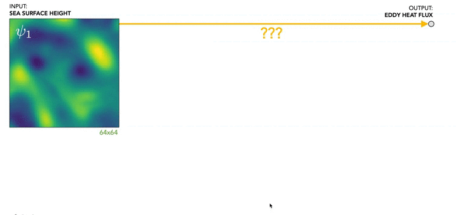
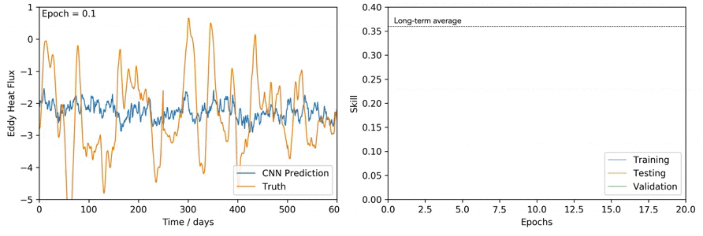

# DeepLearningTurbulence

I use deep convolutional neural networks to predict eddy heat fluxes in turbulent ocean flows. This work was published in Nature Communications and can be found here: https://www.nature.com/articles/s41467-020-20779-9. Note, code in this repo is not the final code used in the paper (which was eventually rewritten for keras and can be found here https://figshare.com/articles/dataset/DeepLearningTurbulence/11920905/1) 

First, we simulate a two-layer ocean dominated by quasigeostrophic turbulence. 

Next we construct a CNN and train it to predict the eddy heat flux given only partial information about the flow, specifically only given the sea surface height field (SSH) which is readily accessible from satellite altimetry. 

## To use:
To use (i.e. train a neural network on QG data) simply open QGmain.py and follow the instructions on there before running. This code works best in an interactive python3 environment (we used Anaconda Spyder). 

## Contents:
•QGmain.py is the primary body of code. It loads the data then manipulates it in any desired way, then interfaces with the neural network architecture (saved in folder Networks) to train and display output. It  saves relevant data at the end. Each run is assinged a "savekey" which can be used to isolated results, saves networks etc.
•Networks contains the tensor flow code for various architectures used. Usually labelled something like NET3c2f.py where 3c = 3 convolutional layers, 2f = 2 fully connected layers. 
•getdata.py pull data from the data folders, loads it as numpy arrays, concatenates, slices, crops, normalises, finds the flux etc, applies filters if required then saves these back into the the folders 'fluxes' and 'fields' as numpy arrays which can be accessed my QGmain.py. If you need to use this there are two functions called save_field and save_flux which do it all, they have four highly logical inputs.
•figure_code.py is just used to plot various figures, there are other older figure codes in the other folder.
•updategit.sh is a shell script for updating the github repository. There is also a hidden file .gitignore which prevents certain folders from syncing.
•QG_matlab contains all the Matlab code used to simulate the baroclinic turbulence. 
•other contains various bits of code including and folder called old_code which has code use pre-15th Aug when we change the data from data32_1000 (now deleted) to data256_4000 along with how the data is manipulated.
•results contains a text file with a printed summary of any completed network training session
•Movies contains some movie files
•figures1&2 contains figures used for interim reports 1 and 2
•figures3 contains figures used after this

## Notes: The code QGmain won't actually work, since the data isn't saved onto GitHub as it is enormous. Please contact me and I can arrange to have the data sent to you. 

